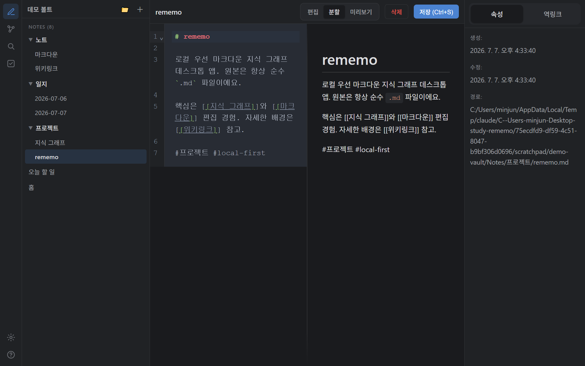
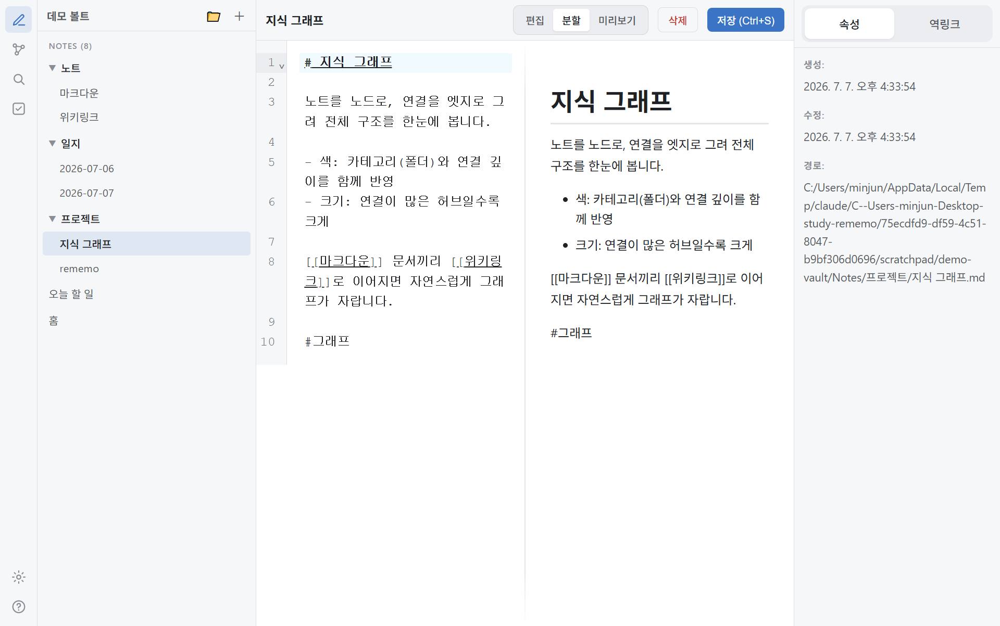
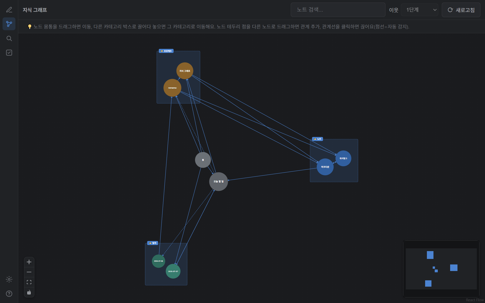
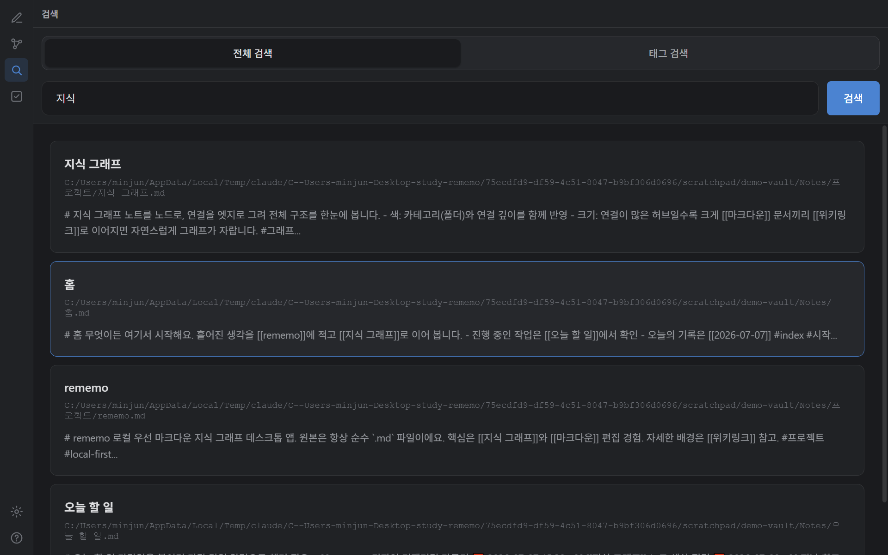
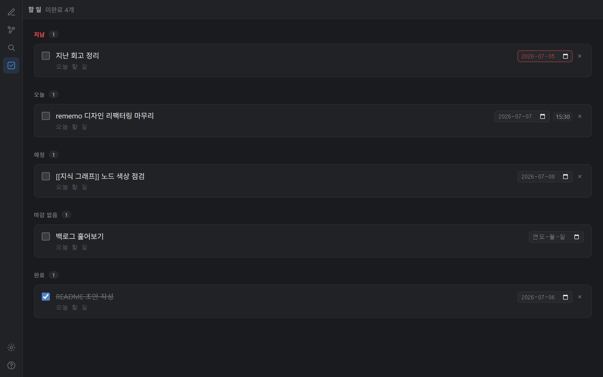
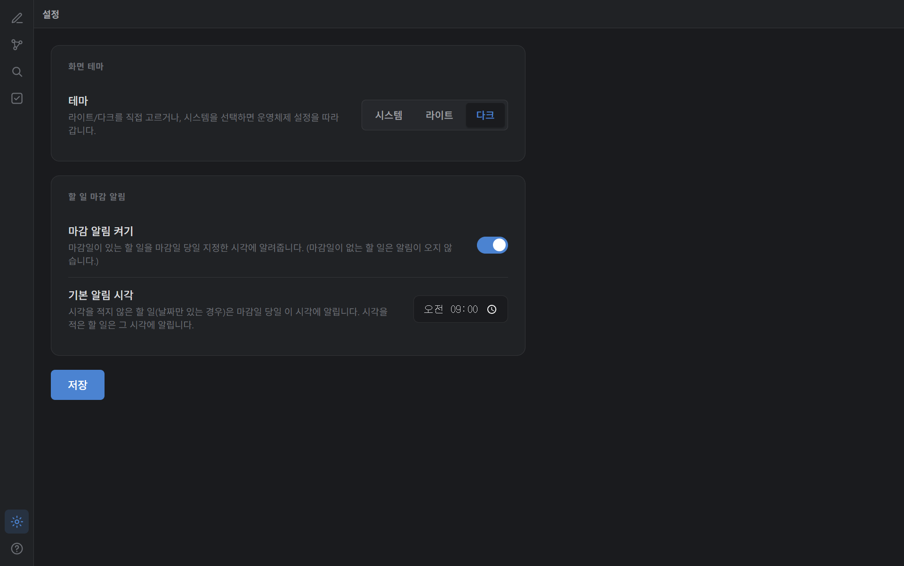

<div align="center">

# rememo

**기억을 연결하는 지식 그래프**

로컬 우선(local-first) 마크다운 기반 지식 그래프 데스크톱 앱

[](../../releases)
[](../../releases)
[](LICENSE)


</div>

---

## 소개

**rememo**는 흩어진 생각을 마크다운 노트로 적고, 노트끼리 연결해 하나의 **지식 그래프**로 키워 나가는 데스크톱 앱입니다.

- 🔒 **완전한 데이터 소유권** — 모든 노트는 내 컴퓨터의 일반 마크다운(`.md`) 파일로 저장됩니다. 클라우드에 올라가지 않고, 앱을 지워도 노트는 그대로 남습니다.
- 🔗 **연결이 곧 지식** — `[[링크]]`로 노트를 잇거나, 노트 제목을 문장에 쓰기만 해도 자동으로 이어집니다. 연결의 전체 모습은 그래프로 한눈에 봅니다.
- ⚡ **로컬 우선 & 오프라인** — 인터넷 없이 동작하고, 파일 시스템 변경을 실시간으로 감지해 인덱스를 자동으로 갱신합니다.
- ✅ **할 일과 마감 알림** — 노트 안의 체크박스가 그대로 할 일이 되고, 마감일이 있으면 알림으로 챙겨 줍니다.

> Obsidian·Logseq와 같은 로컬 우선 노트 앱의 철학을 따르며, 한국어 사용 경험(한글 검색·조사 처리 등)에 초점을 맞췄습니다.

---

## 주요 기능

### 📝 마크다운 에디터



- CodeMirror 6 기반의 마크다운 편집기와 실시간 미리보기(Edit / Preview / Split)
- **좌측 아이콘 레일**로 에디터·그래프·검색·할 일·설정을 오가는 옵시디언식 워크스페이스
- 좌측 노트 목록(카테고리 트리), 우측 **속성 · 역링크** 패널로 구성된 3분할 화면
- `Ctrl+S`(macOS `⌘+S`)로 저장 — 원본은 항상 순수 마크다운 파일
- **라이트 · 다크 테마** — 설정에서 시스템/라이트/다크로 전환(시스템 선택 시 OS 설정을 자동으로 따라감)



### 🔗 지식 연결

- **WikiLink** — `[[노트 이름]]`으로 노트 간 링크 생성
- **앨리어스** — `[[노트 이름|표시 이름]]`으로 링크 텍스트 지정
- **헤딩 링크** — `[[노트 이름#제목]]`으로 특정 섹션 이동
- **자동 연결** — 대괄호 없이 다른 노트의 제목을 문장에 쓰기만 해도 연결(엔티티 멘션)
- **백링크(역링크)** — 현재 노트를 참조하는 노트를 우측 패널에 자동 표시

### 🕸️ 지식 그래프



- 노트를 노드로, 연결을 엣지로 시각화하는 인터랙티브 그래프(React Flow)
- **색은 카테고리(폴더)와 연결 깊이**를, **크기는 연결 수**를 나타냅니다 — 같은 카테고리는 배경 박스로 묶여 한눈에 구분됩니다
- 노드 클릭으로 해당 노트로 즉시 이동, 드래그로 배치 조정(다른 카테고리 박스로 끌어다 놓으면 이동)
- 노트 검색·미니맵·줌 컨트롤 제공

### 🔍 검색



- SQLite 인덱스 기반의 빠른 **전체 검색**과 **태그 검색**
- 제목·본문에서 한글 포함 모든 언어 매칭, 결과에 파일 경로와 미리보기 표시

### ✅ 할 일 & 마감 알림



- 노트 안의 `- [ ]` / `- [x]` 체크박스가 그대로 **할 일** 목록이 됩니다
- 마감일을 붙이는 두 가지 표기 모두 지원:
  ```markdown
  - [ ] 숙제 하기 📅 2026-07-10
  - [ ] 숙제 하기 @due(2026-07-10)
  - [ ] 학원 가기 📅 2026-07-10 15:30   ← 시각까지 지정
  ```
- **지남 / 오늘 / 예정 / 마감 없음 / 완료**로 자동 그룹화
- 할 일 화면에서 체크하면 노트 파일에도 즉시 반영, 마감일도 화면에서 바로 지정·변경
- **마감일이 있는 할 일**은 마감일 당일 지정 시각에 데스크톱 알림 — 날짜만 있으면 설정의 기본 알림 시각, 시각까지 있으면 그 시각에 알림

### ⚙️ 설정



- **마감 알림 켜기/끄기**
- **기본 알림 시각** — 시각을 적지 않은(날짜만 있는) 할 일에 알릴 시각 지정

### 🖼️ 이미지 삽입

- 에디터에 이미지를 **붙여넣기(Ctrl+V)** 하거나 **끌어다 놓으면** vault 안에 저장되고 자동으로 삽입됩니다
- 로컬 이미지는 전용 보안 스킴(`rememo-asset://`)으로 안전하게 미리보기에 렌더링됩니다

### 📂 Vault(노트 공간) 관리

- 여러 Vault(지식 저장소)를 만들고 전환 — 각 Vault는 독립된 폴더·인덱스를 가집니다
- 최근 사용한 Vault 목록에서 빠르게 열기

### ⚡ 실시간 동기화

- `chokidar`로 파일 시스템 변경을 감지 — 외부 에디터에서 수정한 내용도 자동 반영
- 노트 생성/수정/삭제/이름변경 시 인덱스 자동 갱신

### 📖 도움말

- 앱 안의 **도움말** 탭에서 위 기능을 처음 쓰는 사람도 따라 할 수 있게 단계별로 안내

---

## 다운로드 및 설치

최신 버전은 **[Releases](../../releases)** 페이지에서 받을 수 있습니다.

### Windows

**설치 프로그램 (권장)**
1. `rememo-x.x.x-Setup.exe` 다운로드
2. 실행 후 설치 마법사 진행 (설치 위치 선택 가능)

**포터블 버전**
1. `rememo-x.x.x-windows-portable.zip` 다운로드
2. 원하는 위치에 압축 해제 후 `rememo.exe` 실행

### macOS

1. `rememo-x.x.x-mac-arm64.dmg` 다운로드
2. 열어서 `rememo`를 응용 프로그램 폴더로 드래그

> 서명되지 않은 앱이므로 첫 실행 시 우클릭 → "열기"로 실행해야 할 수 있습니다.

### 시스템 요구사항

- Windows 10 이상 또는 macOS (Apple Silicon)
- 약 250MB 여유 공간

---

## 빠른 시작

1. **노트 공간 만들기** — 첫 화면에서 *새 노트 공간 만들기*를 눌러 노트를 담을 폴더를 지정합니다.
2. **노트 작성** — 좌측 목록의 `+`로 새 노트를 만들고, 마크다운으로 작성한 뒤 `Ctrl+S`로 저장합니다.
3. **연결하기** — 다른 노트를 참조하려면 아래처럼 씁니다.
   ```markdown
   [[다른 노트 이름]]
   [[다른 노트|표시할 이름]]
   [[다른 노트#특정 제목]]
   ```
4. **태그 달기** — `#프로젝트 #개발/프론트엔드` 처럼 계층형 태그도 지원합니다.
5. **그래프로 보기** — 상단 *그래프* 탭에서 연결의 전체 모습을 확인합니다.
6. **할 일 관리** — 노트에 `- [ ] 할 일 📅 2026-07-10`을 적고 *할 일* 탭에서 확인합니다.

---

## 데이터 저장 구조

rememo는 모든 데이터를 로컬 파일 시스템에 저장합니다.

```
your-vault/
├── .memograph/
│   └── index.db          # SQLite 인덱스 (검색·그래프용, 자동 생성)
├── Notes/                # 기본 노트 저장 위치
│   ├── 노트1.md
│   └── 노트2.md
├── assets/               # 붙여넣은 이미지 등 첨부 파일
└── vault.json            # Vault 설정 파일
```

**핵심 철학**
- 마크다운 파일이 **원본 데이터**(Source of Truth)
- SQLite는 검색·그래프 성능을 위한 **인덱스**일 뿐 — 지워져도 파일에서 다시 만들 수 있습니다
- **로컬 우선·오프라인 우선**, 모든 파일은 일반 텍스트로 저장되어 **데이터 소유권을 보장**합니다

---

## 기술 스택

| 영역 | 기술 |
|---|---|
| Desktop | Electron 43 |
| UI | React 18 + TypeScript |
| Build | Vite 5 |
| State | Zustand |
| Editor | CodeMirror 6 |
| Markdown Preview | react-markdown + remark-gfm |
| Index/DB | better-sqlite3 |
| Graph | React Flow |
| File Watching | chokidar |

---

## 개발 가이드

npm workspaces 모노레포이며 **두 개의 워크스페이스**로 구성됩니다.

```
rememo/
├── packages/core/        # 도메인 모델 + 마크다운 파서 (진실의 원천)
│   └── src/
│       ├── domain/       # Note, Vault, Link, Tag, Sync 타입·에러
│       ├── parser/       # MarkdownParser (WikiLink/Tag/YAML/EntityMention)
│       └── index.ts      # 공개 API 배럴
└── apps/desktop/         # Electron 앱
    └── src/
        ├── main/         # Main 프로세스 (services / ipc / protocol / database)
        ├── preload/      # contextBridge 안전 API
        └── renderer/src/ # React UI (pages / components / stores / utils / api)
```

> 도메인 타입·파서는 **오직 `packages/core`에만** 정의하고, 데스크톱에서는 `@memograph/core`로 가져옵니다. 자세한 아키텍처·컨벤션·개발 파이프라인은 [CLAUDE.md](CLAUDE.md)를 참고하세요.

### 사전 준비

`better-sqlite3`는 네이티브 모듈이라 로컬 빌드에 컴파일 툴체인이 필요합니다.
- **Windows**: Visual Studio Build Tools의 *"Desktop development with C++"* 워크로드
- **macOS**: Xcode Command Line Tools (`xcode-select --install`)

### 실행

```bash
git clone https://github.com/yourusername/rememo.git
cd rememo
npm install

# 개발 서버 실행
npm run dev
```

Electron ABI 바인딩 문제로 실행이 실패하면 재빌드합니다.

```bash
npx electron-rebuild -f -w better-sqlite3
```

### 검증 (Definition of Done)

```bash
npm run type-check   # 타입 검사
npm run lint         # 린트 (에러 0)
npm run format:check # 포맷 검사
npm test             # 단위 테스트 (Vitest)
npm run build        # 프로덕션 빌드
```

### 빌드 / 배포

`v*` 태그를 push하면 GitHub Actions가 Windows·macOS 러너에서 빌드해 Release에 `.exe`/`.dmg`를 첨부합니다(로컬 툴체인 불필요). 로컬 빌드는 아래를 사용합니다.

```bash
cd apps/desktop
npm run build:win   # Windows 설치 프로그램
npm run build:mac   # macOS (Apple Silicon) dmg
```

---

## 기여 & 문의

이슈 제보, 기능 제안, Pull Request 모두 환영합니다. 문제가 있으면 [Issues](../../issues)에 등록해 주세요.

## 라이선스

[MIT License](LICENSE)
